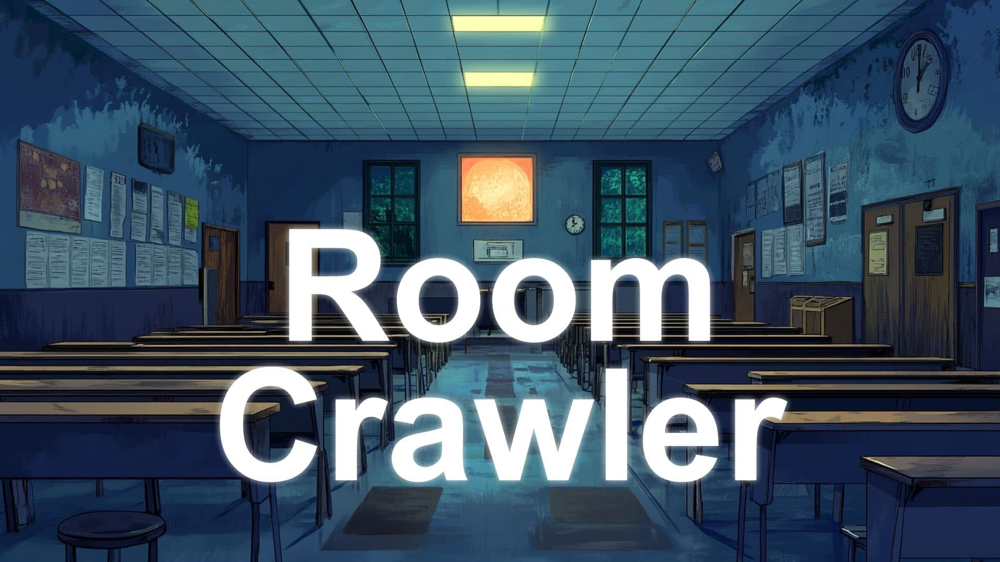

<p align="center">
  
</p>

# Room Crawler

[](https://github.com/remarkablegames/room-crawler/releases)
[](https://github.com/remarkablegames/room-crawler/actions/workflows/build.yml)
[](https://github.com/remarkablegames/room-crawler/actions/workflows/lint.yml)

🚪 <kbd>Room Crawler</kbd> is a roguelike RPG with turn-based combat.

Play in browser:

- [itch.io](https://remarkablegames.itch.io/room-crawler)
- [remarkablegames](https://remarkablegames.org/room-crawler)

Or download:

- [Windows](https://github.com/remarkablegames/room-crawler/releases/latest/download/win.zip)
- [Mac](https://github.com/remarkablegames/room-crawler/releases/latest/download/mac.zip)
- [Linux](https://github.com/remarkablegames/room-crawler/releases/latest/download/pc.zip)

Read the [blog post](https://remarkablegames.org/posts/room-crawler/).

## Features

- **Roguelike turn-based combat** — fight enemies in sequential encounters using energy-based actions.
- **Exploration** — move between rooms and the hall, each with randomized atmospheric descriptions.
- **Progression** — enemies and difficulty scale as you survive more encounters.
- **Skills** — unlock and upgrade abilities that change how you fight, heal, and manage energy.
- **Economy** — earn money from combat and exploration, then spend it in the shop or invest it for rewards.
- **Replayability** — randomized loot, encounters, and rewards make each run different.

## Credits

### Art

- [FantasyLandscapes](https://itch.io/c/3093764/pixel-art)
- [Liminal Games](https://liminal-space-dev.itch.io/free-horror-school-vn-backgrounds)

### Audio

- [Heal Up](https://pixabay.com/sound-effects/heal-up-39285/)
- [Health Pickup](https://pixabay.com/sound-effects/health-pickup-6860/)
- [Heartbeat 01 - BRVHRTZ](https://pixabay.com/sound-effects/heartbeat-01-brvhrtz-225058/)
- [Kenney Interface Sounds](https://kenney.nl/assets/interface-sounds)
- [Punch Sound Effects](https://pixabay.com/sound-effects/punch-sound-effects-28649/)
- [superbrelaxation](https://pixabay.com/sound-effects/superbrelaxation-19606/)

## Prerequisites

Download [Ren'Py SDK](https://www.renpy.org/latest.html):

```sh
git clone https://github.com/remarkablegames/renpy-sdk.git
```

Symlink `renpy`:

```sh
sudo ln -sf "$(realpath renpy-sdk/renpy.sh)" /usr/local/bin/renpy
```

## Install

Clone the repository to the `Projects Directory`:

```sh
git clone https://github.com/remarkablegames/room-crawler.git
cd room-crawler
```

## Run

Launch the project:

```sh
renpy .
```

Or open the `Ren'Py Launcher`:

```sh
renpy
```

Press `Shift`+`R` to reload the game.

Press `Shift`+`D` to display the developer menu.

Clean the cache:

```sh
find game -name "*.rpyc" -delete
```

## Lint

Lint the game:

```sh
renpy game lint
```

## License

[MIT](LICENSE)
